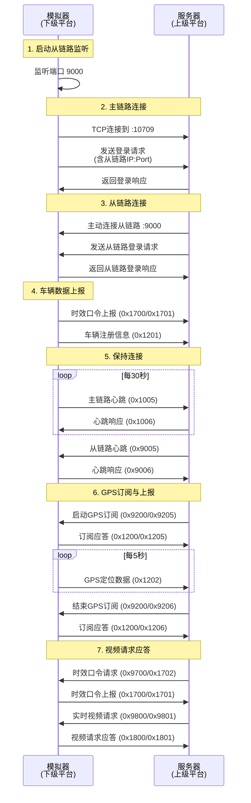

# JT/T 809 下级平台模拟器

## 📖 简介

JT/T 809 下级平台模拟器用于测试上级平台服务器的功能，完整实现了标准的 JT/T 809 协议主链路和从链路交互流程。

### 核心功能

- ✅ 主动连接上级平台主链路
- ✅ 发送登录请求，上报从链路地址
- ✅ 监听从链路端口，接受上级平台的主动连接
- ✅ 响应上级平台的从链路登录请求
- ✅ 主链路心跳保活（每30秒）
- ✅ 从链路心跳响应
- ✅ 时效口令上报（JT/T 1078，登录后主动上报）
- ✅ 时效口令请求应答（JT/T 1078，被动响应）
- ✅ 车辆注册信息上报
- ✅ GPS实时定位数据上报（可配置间隔）
- ✅ 车辆定位信息交换请求应答（订阅/取消订阅GPS）
- ✅ 实时视频请求应答（JT/T 1078）

---

## 🚀 快速开始

### 1. 编译

```bash
cd /Users/shannon/go/src/github.com/zboyco/jtt809
go build -o simulator ./cmd/simulator
```

### 2. 运行（使用默认参数）

```bash
./simulator
```

**默认配置**：
- 上级平台主链路地址: `127.0.0.1:10709`
- 本地从链路监听端口: `9000`
- 用户ID: `10001`
- 密码: `pass809`
- 本地IP地址: `127.0.0.1`
- 车牌号: `粤B12345`
- 车牌颜色: `2` (蓝色)
- GPS上报间隔: `10秒`

### 3. 自定义参数运行

```bash
./simulator \
  -main 192.168.1.100:10709 \
  -sub 9001 \
  -uid 20001 \
  -pwd mypassword \
  -ip 192.168.1.200 \
  -vehicle "京A88888" \
  -color 3 \
  -location 5
```

---

## ⚙️ 命令行参数

| 参数 | 类型 | 默认值 | 说明 |
|------|------|--------|------|
| `-main` | string | `127.0.0.1:10709` | 上级平台主链路地址（格式: `host:port`） |
| `-sub` | int | `9000` | 本地从链路监听端口 |
| `-uid` | int | `10001` | 下级平台用户ID |
| `-pwd` | string | `pass809` | 登录密码 |
| `-ip` | string | `127.0.0.1` | 本地IP地址（上报给上级平台用于从链路连接） |
| `-vehicle` | string | `粤B12345` | 车牌号 |
| `-color` | int | `2` | 车牌颜色（1=黑色,2=蓝色,3=黄色,4=白色,9=其他） |
| `-location` | int | `10` | GPS定位上报间隔（秒），0表示禁用 |
| `-video-ip` | string | `127.0.0.1` | 视频服务器IP（用于mock应答） |
| `-video-port` | int | `8080` | 视频服务器端口（用于mock应答） |

---

## 🔄 工作流程



---

## 📋 测试示例

### 场景1：本地测试

**终端1 - 启动上级平台服务器**：
```bash
cd /Users/shannon/go/src/github.com/zboyco/jtt809
go run ./cmd/server
```

**终端2 - 启动模拟器**：
```bash
./simulator
```

**预期输出（模拟器端）**：
```
Sub Link listening on 127.0.0.1:9000
Connecting to Main Link 127.0.0.1:10709...
Connected to Main Link
Sending Login Request: 5B...5D
Login Response Received
[Main] Sending Vehicle Registration: Vehicle=粤B12345, Color=2
[Main] Starting GPS location updates every 10s
[Main] Sending Location: Lon=114.057868, Lat=22.543099, Speed=40km/h, Direction=90°
Sub Link Incoming Connection from 127.0.0.1:xxxxx
Sub Link Login Request Received
[Sub] Sent Login Response
[Main] Sending Heartbeat: 5B...5D
Heartbeat Response Received
```

---

### 场景2：跨网络测试

假设上级平台服务器在 `192.168.1.100`，模拟器在 `192.168.1.200`。

**服务器端**：
```bash
./server -main :10709
```

**模拟器端**：
```bash
./simulator \
  -main 192.168.1.100:10709 \
  -sub 9001 \
  -ip 192.168.1.200
```

**注意事项**：
- ⚠️ 确保服务器能够访问模拟器的IP和从链路端口
- ⚠️ 检查防火墙规则，确保端口开放
- ⚠️ 如果模拟器在NAT后，需要配置端口映射

---

## 🔍 日志说明

模拟器会输出详细的日志信息，帮助调试：

| 日志内容 | 说明 |
|---------|------|
| `Sub Link listening on ...` | 从链路监听成功 |
| `Connected to Main Link` | 主链路连接成功 |
| `Login Response Received` | 收到主链路登录响应 |
| `[Main] Sending Authorize Report` | 发送时效口令上报 (0x1700/0x1701) |
| `Sending Vehicle Registration` | 发送车辆注册信息 |
| `Starting GPS location updates` | 启动GPS定位上报 |
| `Sending Location` | 发送GPS定位数据 |
| `[Main] Sending Heartbeat` | 发送主链路心跳 |
| `Heartbeat Response Received` | 收到主链路心跳响应 |
| `Sub Link Incoming Connection` | 上级平台连接从链路 |
| `Sub Link Login Request Received` | 收到从链路登录请求 |
| `[Sub] Sent Login Response` | 已发送从链路登录响应 |
| `Sub Link Heartbeat Received` | 收到从链路心跳 |
| `[Main] Authorize Request` | 收到时效口令请求 (0x9700/0x1702) |
| `[Main] Sending Authorize Response` | 已发送时效口令应答 (0x1700/0x1701) |
| `[Sub] Monitor startup request` | 收到GPS订阅请求 (0x9200/0x9205) |
| `[Sub] Monitor startup ack sent` | 已发送GPS订阅应答 |
| `[GPS] Starting GPS reporting` | 启动GPS上报（5秒间隔） |
| `[GPS] Location sent` | 发送GPS定位数据 |
| `[Sub] Monitor end request` | 收到GPS取消订阅请求 (0x9200/0x9206) |
| `[GPS] Stopping GPS reporting` | 停止GPS上报 |
| `[Main] Received Video Request` | 收到实时视频请求 (0x9800/0x9801) |
| `[Main] Video Request` | 视频请求详情（车牌、通道等） |
| `[Main] Video Response Sent` | 已发送视频请求应答 (0x1800/0x1801) |

---

## 🛠️ 开发说明

### 代码结构

- **主链路处理**：主协程负责连接上级平台并发送登录请求
- **从链路处理**：独立 goroutine 监听并处理上级平台的主动连接
- **帧解析**：使用 `splitJT809Frames` 分割器处理 TCP 粘包

### GPS模拟器

模拟器内置GPS数据生成器，可以模拟真实的车辆运动：

- **起始位置**: 深圳市中心（114.057868°E, 22.543099°N）
- **速度范围**: 20-60 km/h
- **方向**: 0-359度，随机变化
- **运动轨迹**: 根据速度和方向自动计算新位置
- **里程累计**: 自动累计行驶里程

### 禁用GPS上报

如果只需要测试连接和心跳功能，不需要GPS数据：

```bash
./simulator -location 0
```

---

## ❓ 常见问题

### Q1: 连接失败？
**A:** 检查：
1. 上级平台服务器是否正在运行
2. 主链路地址和端口是否正确
3. 网络连通性（使用 `telnet` 或 `nc` 测试）

### Q2: 从链路无法建立？
**A:** 检查：
1. `-ip` 参数是否设置为服务器可访问的IP地址
2. 从链路端口是否被防火墙阻止
3. 查看服务器日志中的连接错误信息

### Q3: 登录被拒绝？
**A:** 检查：
1. 用户ID和密码是否与服务器配置匹配
2. 查看服务器日志中的认证失败原因

### Q4: GPS数据没有上报？
**A:** 检查：
1. `-location` 参数是否设置为0（禁用）
2. 主链路是否已成功建立
3. 查看模拟器日志中的错误信息

### Q5: 视频请求没有响应？
**A:** 检查：
1. 主链路是否已成功建立
2. 车牌号是否匹配
3. 查看模拟器日志中的视频请求详情

---

## 📚 相关文档

- [上级平台服务器文档](../server/README.md)
- [JT/T 809 协议库](../../pkg/jtt809)

---

## 🔧 协议实现

本模拟器实现了以下 JT/T 809 标准消息：

**主链路（下级平台 → 上级平台）**：
- `0x1001`: 登录请求
- `0x1002`: 登录应答
- `0x1005`: 主链路心跳请求（每30秒主动发送）
- `0x1006`: 主链路心跳应答
- `0x1200`: 车辆动态信息交换（上行）
  - `0x1201`: 上传车辆注册信息
  - `0x1202`: 实时上传车辆定位信息
- `0x1700`: 视频鉴权（上行，JT/T 1078）
  - `0x1701`: 时效口令上报消息（登录后主动上报）
- `0x1800`: 实时音视频（上行）
  - `0x1801`: 实时音视频请求应答

**从链路（上级平台 → 下级平台）**：
- `0x9001`: 从链路连接请求
- `0x9002`: 从链路连接应答
- `0x9005`: 从链路心跳请求（被动响应）
- `0x9006`: 从链路心跳应答
- `0x9200`: 车辆动态信息交换（下行）
  - `0x9205`: 启动车辆定位信息交换请求
  - `0x9206`: 结束车辆定位信息交换请求
- `0x9700`: 视频鉴权（下行，JT/T 1078）
  - `0x1702`: 时效口令请求（被动响应）
- `0x9800`: 实时音视频（下行）
  - `0x9801`: 实时音视频请求
